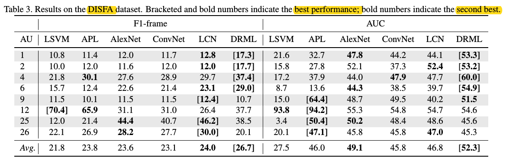

# DRML_pytorch
- Implementation of [**Deep Region and Multi-Label Learning for Facial Action Unit Detection**](https://www.cv-foundation.org/openaccess/content_cvpr_2016/html/Zhao_Deep_Region_and_CVPR_2016_paper.html).

## Statement
- Do the Experiments on the **Cohn-Kanade** dataset. And I only use about 600 images (nearly 500 images for training, 100 images for testing, 12 AU, **no alignment** ). 

- **Compare with and without Region Layer**. In the situation of **without Region Layer**, I use one convolution layer to replace it.

- **Directly train** without sample operation to deal with imbalance between positive and negative samples. So the dataset only contains label (1, -1)

- **Calculate loss** according to the formula in Paper which **considers the label {-1, 0, 1}**. So If you want to do the paper's experiments (positive and negative samples for each AU), you can rewrite the **lib/data_loader**.

- Only calculate the **F1-score**.

## Environment and Compile
- python 3.6
- pytorch 0.3.0

## Accuracy
**With Region Layer**
You can see the results in log file **logs/region_layer.log**.

**Without Region Layer**
You can see the results in log file **logs/without_region_layer.log**.

**Visualization**
The result with region layer is worse than without region layer. I think it maybe have something to do with

- Small dataset (overfitting) which has only 600 images and no sample operation.
- Without alignment.

**Compare to the results in paper**
(Some AU is different from the AU in my experiment)

